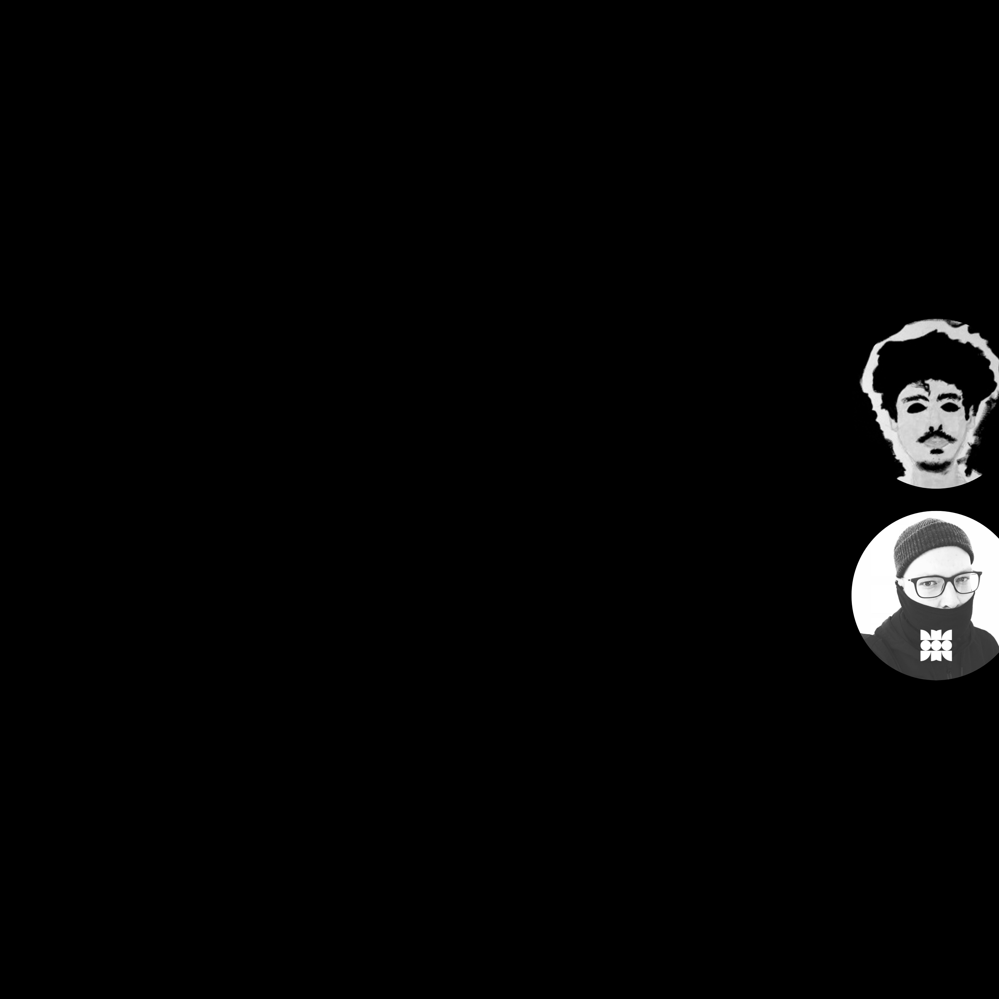

# KILLLXV x MOTHNODE_ Residue

**Listen now:** 
- Soundcloud link
- Spotify link
- IGTV link

## Project Data

Hitech Crime Hybrids release from Killxv and MOTHNODE collaboration.

**Title:** Residue / **Featuring:** Killlxv + MOTHNODE

**Production:** Killlxv + MOTHNODE / **Lyrics:** Killlxv + MOTHNODE

**Narrative Design:**

**Music Video Credits:**

## Lyrics

```
I can see the signs forming all around                   /// MOTHNODE
I've been seering thru the skies
I've been facing wrath of gods

Make up your mind, brethren be damned
Make up your mind, traces all around

So it's all forgiven never count your blessings
See I never felt the vertigos so pressing on my merit
You just better need to heed the omens blood
Seer had a vision but he never sees it all

Hate is the only thing running in my veins               /// KILLLXV
I'm a sick fuck just another product of pain

All of my disciples are rebels they just wanna kill
Murder on my fingertips a source of my adrenaline 

All of these perpetrators that you wanna protect 
They feeding on your soul and leading to your death

Bloodied up bloodied up
Bloodied up bloodied up

Make up your mind, brethren be damned                   /// MOTHNODE + KILLXV
Make up your mind, traces all around

I can see the signs forming all around                   /// MOTHNODE + KILLXV
I've been seering thru the skies
I've been facing wrath of gods

```

## Notes

Beat Suggestions: 
- https://www.youtube.com/watch?v=nhKmmo2QQeU
- https://soundcloud.com/deathwrd/runfromtheseeyes-realtrapshit
- https://www.youtube.com/watch?v=76SlelvVPLU (free for profit)
- https://www.youtube.com/watch?v=9OdpAC5hUMM (free for profit) CHOSEN

Gospel of hate, the RESIDUE of torn connection with humans. It is the issue of residue being the only thing remaining that can bring us back to love of the world but it is really pointless to look for it.

## Music Video
